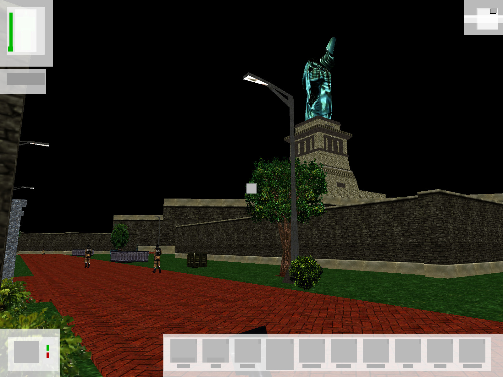
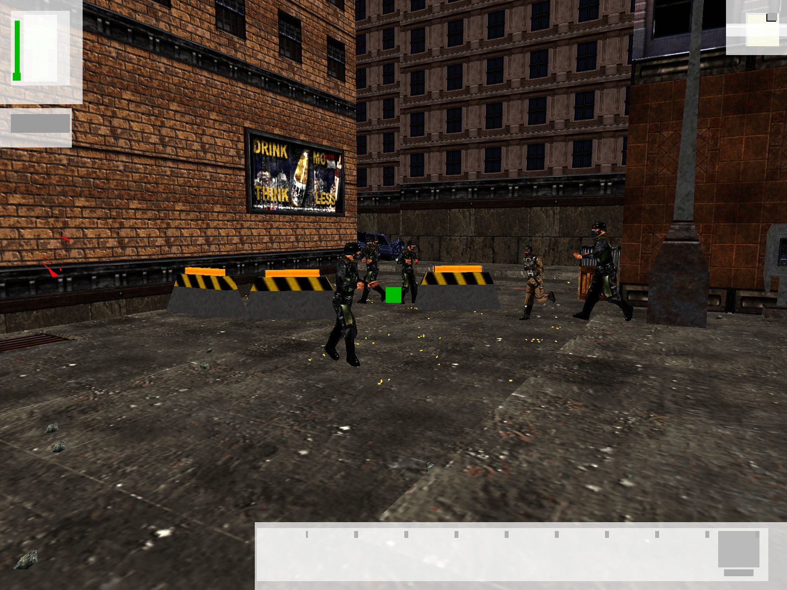

# DeusExVkRender

This is a very experimental renderer for Deus Ex. The idea is to build a renderer that works in a way that's more modern than Deus Ex's default "immediate mode" rendering subsystem.

The code is based on [UT99VulkanDrv](https://github.com/dpjudas/UT99VulkanDrv), though I've ripped out loads of parts that I currently do not need.

## Core idea

Deus Ex (and UE1) ships with a class called `URender` in `Render.dll`. This class is responsible for the absolute majority of work regarding rendering. It traverses the scene graph, traverses the BSP, handles lighting, culls geometry and transforms vertices. The only thing that it doesn't do is the actual drawing - that's delegated to a specific render device (i.e. something that extends `URenderDevice`), which is what most third party renderers for UE1 implement.

So what if we replaced `URender` with our own class? This would give us much more control over how the game is rendered.

Thankfully, it's perfectly possible to replace `URender` with something else. Just point `Engine.Engine.Render` in the config file to an appropriate package and class.

Now it's just about implementing our `URender` replacement. That's going to be a bit of work.

## Status

I'm mainly using this project as an opportunity to learn some Vulkan, so don't expect much. Currently, the project is extremely early in development, although it does actually render things:

There is currently absolutely no culling, no lighting (not even lightmaps), transparency's broken, some animations are broken, some mesh transforms are broken, the UI has no textures (and is in fact still rendered through the old `UT99VulkanDrv` code path), some meshes that should be rendered aren't rendered (and vice versa) and many other issues. But hey, it's a start!
